# Traffic Monitor Parts List

## Adafruit Feather Logger
[Adafruit 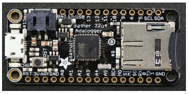](https://www.adafruit.com/product/2795)

## Real Time Clock
###### SunFounder DS3231 RTC Real Time Clock Module
[Amazon 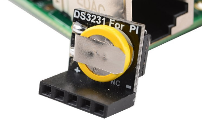](http://a.co/iXUlrvS)

## Ultrasonic Sensor
###### HC-SR04
[Amazon 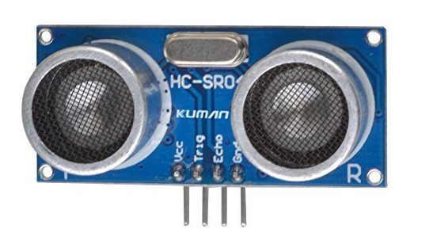](http://a.co/66fF4ZN)

## Pressure Sensor
###### MPS20N0040D-D DIP-6 Sphygmomanometer Pressure Sensor 
[Amazon 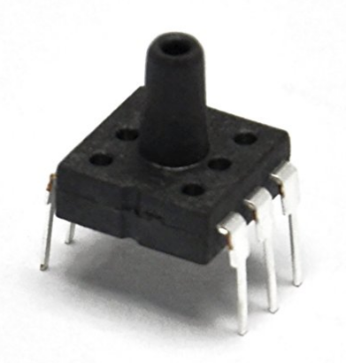](http://a.co/2w9iY43)

## AD Converter for Pressure Sensor
###### HX711
[Amazon 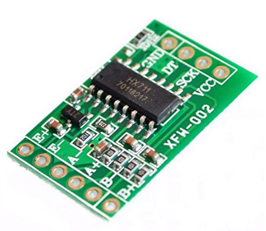](http://a.co/dStwfw3)

## MicroSD Card
###### Any capacity micro sd card
[Amazon 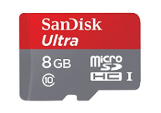](http://a.co/4PxOiKW)

## LEDs
###### Kit Including Red, Green, and Yellow LEDs
[Amazon 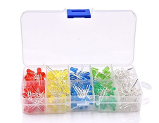](http://a.co/9h8RSNi)

## Battery Connector
###### JST-PH 2.0 Pin Male Female Connector 
NOTE: Polarity may be reversed for this application. Wires can me switched according to instructions or soldered in reverse.
[Amazon 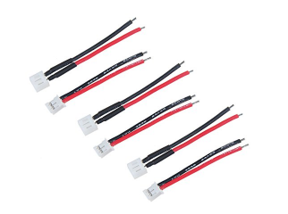](http://a.co/2IehiXu)

## Case
###### Pelican 1120 Watertight Hard Case, No Foam
[Amazon 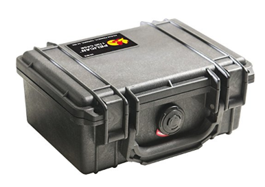](http://a.co/cRQ5KJj)

## D-cell Batteries and Charger
###### Tenergy T9688 Universal Charger and Standard Battery Combos
[Amazon 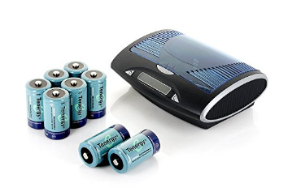](http://a.co/0S0hDjA)

## Battery Holder
###### SEOH Double Battery Holder D With 12in Wire Leads
NOTE: 2 pcs required
[Amazon 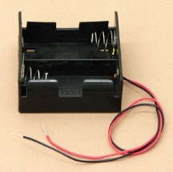](http://a.co/gLmfJ8y)

## Rubber Hose
###### Norprene Blended Rubber/Plastic Tubing, Flexible, Black, Opaque, 61A Durometer, 3/8" ID, 1/2" OD, 1/16" Wall, 10'
[Amazon 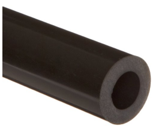](http://a.co/0GD1P7Y)

## On-Off Switch
###### Toggle Switch SPST ON-OFF Type 2 pin 12V 25A with waterproof cover
[Amazon 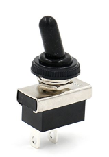](http://a.co/bfGbhY3)

## Double Sided Foam Tape
###### 3M 411-Long Scotch Exterior Mounting Tape
[Amazon 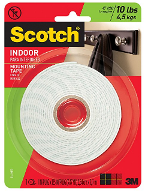](http://a.co/76sODvUlink)
